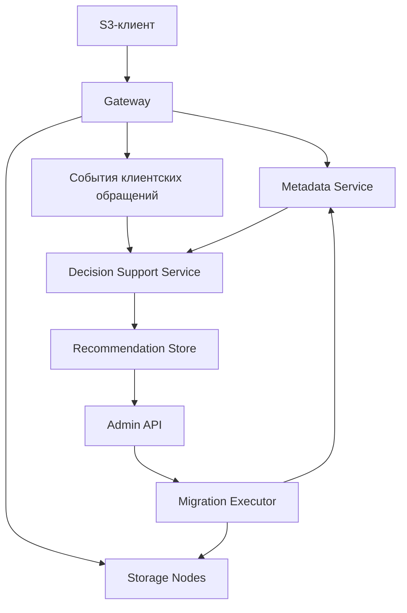
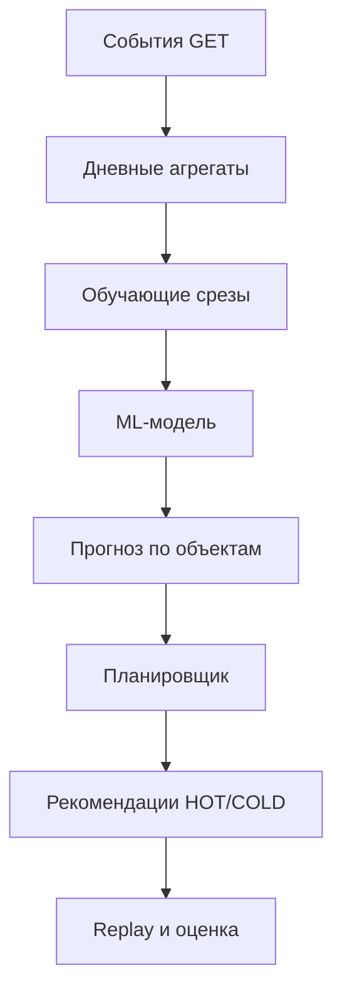

**Тему стоит сохранять. Но сейчас в ней убедительнее описано, что система будет делать, чем доказано, почему её решения будут правильными и полезными.**

Подготовил подробную рецензию на 13 страниц: [opens3_vkr_review.pdf](opens3_vkr_review.pdf). Внутри — исправленные формулировки, математическая постановка, экспериментальный протокол и приоритеты доработки.

Оцениваю именно **концепцию ВКР**: в приложении пока описание и план, без результатов экспериментов.

Самые серьёзные замечания:

1. **Модель прогнозирует не ту величину, которая нужна формуле затрат.**  
    Вероятность «хотя бы раз прочитают за месяц» не различает одно чтение и тысячу. Два объекта могут иметь одинаковую вероятность обращения, но совершенно разную стоимость обслуживания. Если оплачивается каждый GET, нужно ожидаемое число чтений и, при необходимости, объём данных. Альтернатива — сохранить бинарный прогноз, но сузить целевую функцию. Откладывать это несоответствие «на дальнейшее развитие» нельзя.
    
2. **Разделение 60/20/20 ещё не защищает от утечки будущего.**  
    Снимок объекта от 29 июня использует для своей метки следующие 30 дней. Если включить его в обучение модели, которую проверяют с 1 июля, модель уже знает часть июля. Нужны границы по моменту доступности меток. В PDF приведён конкретный пример корректного разделения.
    
3. **Горизонт 30 дней выбран раньше данных.**  
    Пока неизвестно, откуда возьмутся достаточная история, будущие метки и несколько независимых периодов проверки. Например, описанные в исследовании IBM COS трассы охватывают неделю — для такой постановки этого недостаточно. Миллионы запросов не заменяют календарную длительность. [Первоисточник](https://www.usenix.org/system/files/hotstorage20_paper_eytan.pdf).
    
4. **«Бустинг предсказывает обращения и управляет tiering» — уже известная идея.**  
    Это присутствует в исследовании 2019 года, включая вероятность доступа и признаки истории обращений. Защищаемый вклад здесь — конкретный метод принятия решений, интеграция с OpenS3 и воспроизводимое исследование условий, где ML окупается. [Исследование](https://arxiv.org/html/1907.02394v2).
    
5. **Успешные чтения могут скрывать реальный спрос.**  
    Перенёс объект в COLD → появились таймауты → успешных GET стало меньше → модель решила, что объект никому не нужен. Для корректного эксперимента нужно различать попытки обращения, успешность и задержку.
    
6. **Состояние платформы надо описывать точнее.**  
    Базовый Metadata уже реализован синхронно. Асинхронный lifecycle остаётся в [issue #65](https://github.com/alesplll/opens3-rebac/issues/65), Gateway — в открытом [PR #39](https://github.com/alesplll/opens3-rebac/pull/39). Поэтому нельзя считать весь S3-контур готовой экспериментальной базой. Запуском его работоспособность я не проверял.
    

При этом **ML здесь уместен, а признаки СППР действительно есть**: прогноз неизвестного спроса, альтернативы, ограничения, объяснение и выбор администратора. Отделение модели от алгоритма решения — сильная часть концепции.

**Первым делом я бы зафиксировал четыре вещи:** что означает COLD, какие затраты считаются, какие данные доступны и как устроено честное сравнение. Затем — автономный replay-прототип. Достройка Gateway и полировка текста должны идти уже вокруг проверяемой постановки.

---

  
1. Что в OpenS3 есть на самом деле  
Срез репозитория проверен 9 сентября 2026 года: main, commit  
86e9b98cb59775fafeefd245f84afdf330d7cf9b. Отдельно просмотрен открытый PR #39 с Gateway,  
head ebdb142ca1c220bcfa418257d41eb2f837e9b4de. Выводы основаны на issues, дереве и  
выбранных файлах кода; работоспособность кластера запуском не проверялась.2,6  
Часть Подтверждённое состояние Следствие для ВКР  
Storage Есть файловое хранение, streaming RPC, Range,  
multipart и тесты.  
Это существующая инженерная  
база, а не компонент, который  
нужно писать заново.  
Metadata CreateObjectVersion выполняет UpsertObject,  
InsertVersion и SetCurrentVersion в транзакции.  
Issue #50 закрыт.  
Базовый синхронный каталог уже  
реализован.  
Схема версий Есть objects, versions, current/pending pointers;  
нет полей класса и узла размещения.  
Нужно расширение каталога  
размещения, а не перенос всех  
полей в objects.  
Асинхронный  
lifecycle  
Issue #65 открыт; схема подготовлена,  
runtime-переходы и outbox ещё запланированы.  
Нельзя описывать Kafka-finalize как  
уже работающую часть.  
Gateway и E2E В main нет services/gateway; есть открытый PR  
#39. Issues #51-54 открыты.  
Наличие кода в PR не доказывает  
готовый S3-контур.  
СППР и tiering В просмотренном main не найдены  
специализированный ML-сервис и реализация  
HOT/COLD-плана.  
Это основной новый результат  
диплома.  
README противоречив: одновременно описывает S3-клиентов, называет Metadata Python-сервисом  
и утверждает, что Metadata не реализован. Код и issue #50 показывают базовую реализацию на  
Go. В дипломе нельзя наследовать эти формулировки. Нужны две архитектурные схемы:  
«существующая система» и «добавления ВКР».2,3,4,5,7  
Две ошибки в backlog, которые опасно переносить в текст  
В issue #64 ETag приравнен к ключу идемпотентности и заявлено, что повторный PUT одинакового  
файла должен давать одну версию. Для versioning-enabled S3 PUT создаёт новую версию:  
одинаковое содержимое само по себе не означает повтор одной операции. Для внутренних  
команд миграции нужен отдельный идентификатор операции.8,9  
В issue #52 предложен ответ 200 до завершения обновления Metadata, а #54 допускает ожидание  
видимости через Eventually. Это может расходиться с strong read-after-write consistency S3.  
Асинхронность внутри допустима, но успешный ответ клиенту должен соответствовать  
заявленной семантике видимости. Для минимального стенда проще сохранить синхронную  
регистрацию уже записанного blob.7,20  
2-7. OpenS3: зафиксированный main, исходники Metadata/Storage, issues #50-54, #65 и PR #39. 8. Issue #64. 9. AWS,  
How S3 Versioning works. 20. AWS, What is Amazon S3?, consistency model.

2. Новизна и корректное сравнение с аналогами  
На вопрос «что здесь нового?» нельзя отвечать «машинное обучение выбирает горячее или  
холодное хранение». В работе Herodotou и Kakoulli 2019 года уже есть прогноз вероятности  
обращения через XGBoost, признаки размера и истории доступа и политики  
повышения/понижения уровня хранения. Другая инфраструктура не отменяет близость идеи.12  
Источник / аналог Что уже существует Чему учит сравнение  
AWS S3 Lifecycle Переходы по возрасту/дате, фильтры  
по размеру, префиксу и тегам.  
Не описывать все правила как  
примитивный таймер без учёта  
характеристик.  
AWS S3  
Intelligent-Tiering  
Автоматическое перемещение по  
отсутствию обращений и возврат при  
доступе.  
Сравнение только с возрастом объекта  
недостаточно. Нужен recency-baseline.  
Herodotou, Kakoulli,  
2019  
ML-прогноз доступа и управление  
уровнями распределённого файлового  
хранилища.  
Сам выбор бустинга и вероятности  
обращения уже известен.  
SCOPe, ICDE 2023 Оптимизация затрат с прогнозами  
доступа, размещением и сжатием.  
Прогноз должен соответствовать  
величинам в целевой функции.  
Khan и соавт., 2024 Правила и игровой подход для  
перераспределения между четырьмя  
уровнями.  
Сильные эвристики также способны  
давать экономию.  
Baleen, FAST 2024 ML admission/prefetch для flash-cache,  
оценка по нагрузке на backend.  
Качество классификации не заменяет  
системный результат.  
В исходной актуальности смешаны Lifecycle и last-access tiering. В AWS Lifecycle переходы  
задаются возрастом или датой; автоматический учёт отсутствия обращений относится к  
Intelligent-Tiering. У его автоматических уровней остаётся низкая задержка; часовые задержки  
относятся к дополнительным архивным уровням. Следовательно, «холодный всегда медленный» -  
допущение конкретного стенда, а не универсальное свойство S3.10,11  
Защищаемый вклад  
Предлагаемый вклад: воспроизводимая оценка интеллектуального метода размещения объектов  
при ограничениях ёмкости, задержки и миграционного бюджета; реализация объяснимых  
рекомендаций и контролируемого применения в OpenS3; определение режимов нагрузки, где ML  
окупается либо проигрывает эвристикам. Это содержательная цель прикладной ВКР без  
заявления мировой алгоритмической новизны.  
Нужно отдельно перечислить личные изменения автора: контракты событий и размещения,  
подготовка данных, обучение, алгоритм рекомендаций, интеграция, стенд и анализ.  
Общекомандные AuthZ, Users и прочие сервисы следует описывать как используемую платформу,  
если они не являются личным результатом.  
10-11. Официальная документация AWS. 12. Automating Distributed Tiered Storage Management, 2019. 13. SCOPe, 2023.  
3. Khan et al., Computing, 2024. 15. Baleen, FAST 2024. Исследования относятся к разным системам; их  
опубликованные проценты экономии на OpenS3 не переносятся.

4. Главная проблема: прогноз и функция затрат  
В исходнике модель оценивает p = P(N > 0), где N - число чтений на горизонте H. В формуле риска  
эта вероятность умножается на стоимость чтения. Если каждый GET оплачивается отдельно и  
объект остаётся в COLD, такое выражение недооценивает затраты при повторных чтениях. Это  
содержательная ошибка, а не вопрос оформления формулы.1  
Контрпример  
У объектов A и B одинаковые размер и p = 0,5. A при возникновении спроса читают один раз, B -  
тысячу раз. Тогда E[N_A] = 0,5, E[N_B] = 500. При условной цене одного холодного чтения 1 и  
экономии хранения 5 за горизонт объект A выгодно охладить, B - оставить горячим. Исходная  
формула даст им одинаковую ожидаемую стоимость чтений 0,5. Числа иллюстративные, это не  
измерения и не тарифы провайдера.  
Рекомендуемая постановка для оценки совокупных затрат  
Зафиксировать размещение между моментами пересчёта, читать COLD напрямую, без скрытого  
автоматического возврата в HOT. Обозначить s размером в GiB, cs,a - стоимостью GiB-дня, cq,a -  
стоимостью запроса, cb,a - стоимостью GiB чтения. Тогда:  
Ji(a) = si H cs,a + Cmove(aold, a, si)  
+ E[Ni | xi] cq,a + E[Bi | xi] cb,a  
B - объём прочитанных данных в GiB. Для минимального эксперимента с полными GET можно  
принять E[B] = s E[N] и явно исключить Range. Для Range нужен самостоятельный прогноз объёма  
либо эмпирическая оценка размера чтения. Разовые миграции учитываются только при смене  
класса. При повторном пересчёте прогноз на H не суммируется в отчёт: фактические расходы  
начисляются по реально прошедшим интервалам.  
Минимальное исправление ML: добавить прогноз числа чтений, например регуляризованную  
count-regression и бустинг для неотрицательного счётчика. Классификатор p можно сохранить  
для оценки риска хотя бы одного обращения. Если использовать двухчастную модель, то E[N] =  
P(N>0) × E[N | N>0]. Это расширение необходимо именно из-за заявленной экономики; его нельзя  
безоговорочно откладывать «после защиты».  
Вариант с меньшим объёмом ML  
Можно сохранить только бинарный прогноз, но тогда сузить целевую функцию до стоимости  
хранения и штрафа за сам факт холодного обращения. Такой штраф начисляется один раз  
объекту за горизонт; это не совокупная стоимость всех GET. Автоматическое повышение при  
первом чтении само по себе проблему не решает: понадобятся время первого доступа, стоимость  
возврата, последующее занятие HOT и политика вытеснения.  
Ёмкость и допустимость  
План минимизирует сумму J при Σ si·I(ai=HOT) ≤ K, ограничениях pinned, резерва для новых  
записей и миграционного бюджета. Δ/s - эвристика для объектов переменного размера. В  
исходнике её приближённость уже признана правильно. Нужны обработка нулевых размеров,  
пропуск не помещающихся объектов и сравнение с точным решением на небольшом  
подмножестве.  
1. Исходный файл, «Как формируется рекомендация» и «В дальнейшее развитие». Контрпример, формализация и  
предлагаемые исправления являются аналитическими выводами рецензии.

2. Данные: самый ранний риск проекта  
Горизонт 30 дней задан до выбора данных. Между тем нужны не только 30 дней будущих меток,  
но и история признаков до 90 дней, несколько временных периодов и наблюдения новых  
объектов. Большое количество строк в короткой трассе не заменяет календарную длительность.  
Сначала следует подтвердить данные, затем фиксировать H.  
Источник Что можно обосновать Ограничение  
Собственная трасса  
OpenS3  
Полный контракт операций,  
идентификаторы и измерение  
задержки.  
Пока нет подтверждённой длительной  
нагрузки и пользовательского спроса.  
IBM COS / HotStorage  
2020  
В статье описаны 99 недельных  
tenant-трасс с PUT, GET, DELETE и  
размерами.  
Неделя не подходит для 30-дневных  
меток. Это кандидат для отдельного  
короткого горизонта.  
dropboxCollectedData Авторский репозиторий содержит  
eval.zip для близкой работы по tiering.  
Проверено наличие, но не содержимое  
архива: длительность, лицензия и поля  
требуют аудита.  
Синтетический  
генератор  
Позволяет контролировать  
сезонность, всплески, новые объекты  
и дрейф.  
Проверяет метод в заданной модели  
спроса, не доказывает экономию на  
реальном workload.  
IBM COS и Dropbox здесь являются кандидатами, а не уже подготовленными датасетами ВКР. Для  
воспроизведения нужны источник, версия/хеш, доступность, условия использования,  
длительность, временная зона, единицы размеров, схема и правила обработки пропусков.16,17  
Нельзя обучаться только на объектах, встретившихся в GET  
Снимок выборки должен включать все существующие допустимые объекты, в том числе ни разу  
не прочитанные. Если создать universe по всем ключам всей трассы, в прошлое попадут ещё не  
существовавшие объекты. Если использовать только журнал чтений, из выборки исчезнут самые  
холодные данные. Нужен начальный inventory либо честно ограниченная когорта объектов,  
созданных наблюдаемыми PUT.  
Успешное чтение и спрос - разные величины  
После переноса в COLD могут участиться таймауты. Модель, обученная только на успешных GET,  
может принять ухудшение доступности за исчезновение спроса. Для эксперимента нужен  
независимый поток попыток авторизованного чтения существующих объектов, а успешность и  
latency - отдельные исходы. В baseline-нагрузке без отказов успешные GET допустимы, но граница  
применимости должна быть указана.  
Событие должно различать логическую операцию и повтор доставки: event_id, request_id,  
event_time, ingestion_time, object_id, version/generation_id, bytes, status, latency и  
origin=client/migration. Чтение executor-ом для копирования не является пользовательским  
спросом. Повторы Kafka необходимо дедуплицировать; поздние события учитывать по  
объявленному watermark. Отсутствие доставленного события ещё не равно отсутствию запроса.  
Размер выборки и вычислительная стоимость  
Ежедневный снимок миллиона объектов даёт 30 миллионов примеров за месяц. Поэтому нужны  
агрегаты по окнам, пакетная обработка и замеры CPU/RAM, а не сканирование всей истории на  
каждую рекомендацию. Для начала достаточно ограниченного inventory с опубликованным  
размером и проверкой масштабирования.  
5. Eytan et al., It’s Time to Revisit LRU vs. FIFO, HotStorage 2020, раздел 3. 17. FlavioAAMotta/dropboxCollectedData,  
README и список файлов. Остальные пункты - требования к предлагаемому эксперименту.

6. Временная валидация и качество модели  
Условие «timestamp признаков ≤ t» необходимо, но недостаточно. Если train заканчивается 30  
июня, то метка снимка от 29 июня использует обращения июля. Модель, якобы доступная 1 июля,  
уже обучена на будущем. Аналогично метки validation могут залезть в test. Удаление последних  
30 дней всей трассы исправляет только её правый край.1  
Правило доступности метки  
В модель, выпускаемую в момент T, допускаются примеры только с t + H ≤ T. Калибровка и  
подбор политик также должны закончить своё целевое окно до начала финального теста.  
Границы проводятся по времени, а не по количеству строк. Параметр gap у TimeSeriesSplit сам по  
себе этого не гарантирует: он задаётся в числе примеров; для нерегулярных событий нужны  
явные временные маски.19  
Иллюстрация: H = 30 дней Моменты снимков t Когда все метки известны  
История признаков / warm-up дни 0-89 до начала train  
Обучение выбранной модели дни 90-269 к дню 299; выпуск в день  
300  
Калибровка вероятностей дни 300-359 к дню 389  
Выбор параметров политики дни 390-449 к дню 479  
Финальная оценка дни 480-509 к дню 539  
Это пример корректного расписания для длинной синтетической трассы, а не требование ждать  
полтора года и не обнаруженный датасет. Гиперпараметры модели подбираются внутренними  
временными folds в train. Если данных меньше, следует уменьшить горизонт/окна и число стадий,  
сохранив правило доступности меток; финальный test остаётся закрытым.  
Что убрать из модели спроса  
Текущий storage_class и время последней миграции отражают предыдущую политику. Они могут  
быть доступны честно по времени, но приводят к зависимости прогноза от способа размещения и  
сдвигу при новой политике. Для базовой модели спроса их лучше убрать и оставить в decision  
engine. Это не автоматическая «утечка будущего», а риск feedback bias. Аналогично нагрузка и lag  
относятся к исполнению, как уже верно отмечено в исходнике.  
Калибровка - измеряемое свойство  
Калибратор обучается на данных, не использованных для fitting классификатора. Нельзя  
выбирать лучший калибратор по test. Brier score отражает одновременно калибровку и  
различительную способность; один низкий Brier не доказывает качественную калибровку. Нужны  
reliability diagram, размеры групп и проверка около экономического порога решения.18  
PR-AUC полезна при редком положительном классе, но исходный дисбаланс сначала нужно  
измерить. Для count-модели дополнительно оцениваются ошибка ожидаемых чтений и качество  
по группам размера/популярности. Новые объекты оцениваются отдельной когортой; повторное  
присутствие старого объекта в будущем test допустимо для реального сценария  
прогнозирования.  
6. scikit-learn, Probability calibration. 19. scikit-learn, TimeSeriesSplit. Пример временных интервалов и правила  
доступности меток выведены для горизонта из исходной концепции.

7. Эксперимент, который действительно проверяет  
ML  
Сравнение должно отвечать на два разных вопроса: улучшает ли прогноз решения при одном и  
том же планировщике и превосходит ли вся новая политика простые альтернативы. Если только  
ML получает hysteresis, ограничения миграций и разумный cold-start, выигрыш нельзя  
приписывать модели.  
Сравнение Зачем оно нужно  
Возрастной порог и порог last GET Проверить две различные разновидности правил;  
параметры подбирать на validation.  
LRU и LFU/EWMA Разделить эффекты давности и частоты. Определить  
admission, promotion и eviction.  
Простой прогноз интенсивности + общий  
planner  
Изолировать пользу сложного ML от пользы самого  
экономического оптимизатора.  
ML + тот же planner Основной метод, с теми же тарифами, лимитами и  
защитными правилами.  
Без калибровки / без bucket-признаков Две ограниченные ablation-проверки заявленных  
преимуществ.  
Точный solver на малой задаче Понять потери жадного Δ/s; это тест planner, а не  
online-конкурент.  
Одно и то же исходное событие, разные состояния политики  
Replay подаёт всем методам одинаковые попытки GET/PUT и размеры. Каждая политика имеет  
отдельные состояние классов, очереди миграций и расход ёмкости. Задержка, стоимость и  
ошибки рассчитываются для её состояния. Нельзя проигрывать только исторические успешные  
чтения и переносить историческую latency в альтернативное размещение.  
Нужно заранее определить: период решения Δt, горизонт H, начальную раскладку, резерв HOT,  
действия при переполнении, чтение из COLD, поведение при отказе в переносе и лимит байтов  
миграции за период. Бюджет числа объектов недостаточен: один файл может быть больше тысяч  
остальных. Новые объекты «всегда HOT» допустимы только при наличии резерва и явного  
fallback.  
Реальные и моделируемые результаты  
Длительный trace replay может работать в виртуальном времени и оценивать политику.  
Нагрузочный запуск на двух Data Node измеряет фактические задержки, overhead и целостность.  
Ускорить 30 дней до минут и затем назвать wall-clock latency характеристикой исходной нагрузки  
нельзя: изменятся очереди и конкуренция. Для эмулированного COLD отдельно задать bandwidth,  
IOPS, задержку и правила очереди; sleep сам по себе не моделирует HDD.  
Сценарии и критерий результата  
Нужны: длинный хвост, повторяющиеся всплески, cold-start, смена популярных объектов и  
отрицательный контроль - спрос без предсказуемой связи с признаками. Для синтетики  
зафиксировать генератор и несколько seed до просмотра test. Не генерировать метки правилом  
«старый и редко читали = холодный»: метка получается только из будущей последовательности  
событий.  
Основной результат - затраты на закрытом test и разность с лучшим baseline по независимым  
трассам/seed. Показать разброс и доверительные интервалы; снимки одного объекта  
коррелированы. Проверить чувствительность к ёмкости HOT и цене миграций. При отсутствии  
выигрыша объяснить причину, а не менять test-нагрузку.  
Методика предложена для этой ВКР. 15. Baleen служит примером системной оценки ML; его собственные метрики и  
результаты не используются как прогноз эффективности OpenS3.

7. SLA, стоимость и рекомендации администратору  
В тексте SLA одновременно назван ограничением и денежным штрафом. Это разные модели.  
Конечный штраф допускает нарушение, когда экономия выше штрафа. Поэтому нельзя на  
основании минимального R обещать соблюдение SLA. Для учебного стенда точнее говорить о  
заданной цели качества обслуживания SLO; термин SLA оставлять для явно определённого  
соглашения.  
Рекомендуемый минимальный контракт качества  
Зафиксировать измерение от поступления GET в Gateway до последнего байта либо до первого  
байта - выбрать одно основным. Определить порог Lmax, период измерения и допустимую долю  
превышений ε. В эксперименте считать долю GET с L > Lmax, отдельно учитывать  
таймауты/ошибки и показывать p95/p99 по группам размеров. Среднее latency не заменяет хвост.  
Для упрощённой модели ожидаемое число превышений при размещении a можно оценивать как  
E[Ni]·qa(si,load), где q - условная вероятность превышения порога на запрос. Суммарный риск  
сопоставляется с ожидаемым числом запросов. Это модельная оценка, а не гарантия: реальные  
очереди связывают объекты, и ограничение дополнительно проверяется replay и стендом.  
Проверка на вырожденную постановку  
Если каждое холодное чтение нарушает жёсткое требование «ни одного медленного GET», а  
любой объект может быть востребован, разрешённых холодных размещений может не оказаться.  
Если HOT меньше обязательного pinned-набора, задача также недопустима. СППР должна  
сообщать о несовместимости требований и предлагать изменить лимит/ограничение, а не молча  
нарушать его.  
Метрика Однозначное определение  
Совокупные затраты Хранение по фактическому времени + запросы + прочитанные байты +  
миграции + оговорённые издержки СППР.  
Нормированные затраты J(policy)/J(reference) на одном workload; reference общий. Условные цены  
локальных HOT/COLD не являются денежной экономией владельца;  
проверить чувствительность к их соотношению.  
False-cold rate Число HOT→COLD переносов с последующим GET в течение H / число  
HOT→COLD переносов с полностью наблюдаемым H.  
Доля холодных чтений GET, обслуженные COLD / все допустимые GET. Отдельно доля  
прочитанных байтов из COLD.  
Миграционная нагрузка Число переносов, суммарные байты, пиковая очередь и временное  
дублирование данных.  
Полезная рекомендация - это действие с актуальными условиями  
Хранить plan_id, object/version_id, ожидаемую generation метаданных, model/feature version, время  
расчёта, срок действия, HOT/COLD стоимость и причину блокировки. В интерфейсе показывать  
ожидаемый эффект всего плана и альтернативу «сохранить текущее размещение», а также  
изменение результата при другом лимите HOT.  
Факторы прогноза не равны причинам выбора: например, модель ожидает мало чтений, но  
перенос заблокирован pinned или недостатком места. Важности признаков не следует  
представлять как доказательство причинности. Ручное подтверждение следует испытывать  
отдельно; в replay допустимо явно принять режим немедленного одобрения всех допустимых  
рекомендаций.  
Все определения на этой странице - предлагаемый контракт эксперимента; они не являются полученными  
измерениями или действующими соглашениями OpenS3.

8. Архитектура: минимальная, но непротиворечивая  
Разделение на Python Decision Support Service и Go data path разумно. Однако обучение модели,  
агрегирование событий и выдачу рекомендаций необязательно разворачивать как отдельные  
микросервисы. Для диплома достаточно одного Python-проекта с offline-командами и небольшим  
API, PostgreSQL для плана и batch inference вне PUT/GET пути.  
Единица миграции должна быть неизменяемой  
В текущей схеме blob_id и size_bytes принадлежат versions, а objects хранит указатель на текущую  
версию. Поэтому размещение логично привязать к version_id/blob_id в отдельной таблице location  
либо к версии. Перенос не должен менять current_version_id. Даже если исследование старых  
версий исключено, нужно зафиксировать generation целевого содержимого и отклонять  
устаревшие рекомендации.3,4  
Иначе администратор подтверждает план для вчерашнего key, который сегодня перезаписан, а  
исполнитель перемещает или переключает уже другой blob. Простой эксперимент на  
неизменяемых объектах допустим; эксперимент с PUT обязан определить, прекращается ли  
наблюдение старой версии, как считается новая и какие байты входят в ёмкость.  
Минимальный протокол исполнения  
9. Повторно проверить generation, доступную ёмкость, запреты и срок рекомендации;  
зарезервировать место назначения.  
10. Создать migration_id и запись состояния; копировать конкретный immutable blob.  
11. Проверить размер и checksum, затем атомарно переключить location через CAS.  
12. При конфликте сохранить действующее размещение; пометить копию для очистки.  
13. Исходный blob удалять только после того, как нет актуальных ссылок и незавершённых  
читателей; повтор команды не должен менять итог.  
Фраза «распределённая crash-safe миграция вне диплома» допустима как ограничение  
надёжности. Но при демонстрации реального переноса нельзя исключить все сбои и гонки.  
Минимально нужны проверки: повтор подтверждения, ошибка копирования, устаревшая  
generation, нехватка места, чтение во время переключения. В ограниченном стенде GC можно  
сделать ручным с проверкой ссылок вместо обещания полноценной распределённой сборки  
мусора.  
Временная вторая копия тоже занимает место  
Сохранение источника после миграции не бесплатно и не освобождает его физическую ёмкость  
немедленно. Планировщик должен различать целевое размещение, текущее занятие диска и  
pending cleanup. Иначе рекомендация «освободить HOT» может быть логически выполнена, а диск  
останется заполненным. Порядок переносов также важен: допустимый конечный план может не  
помещаться в промежуточном состоянии.  
Граница S3-совместимости  
Два экземпляра одного Data Node с разными каталогами ещё не являются двумя классами  
производительности. Нужна объявленная физическая или эмулированная разница. Для Gateway  
сформулировать проверяемое подмножество: path-style, базовые PUT/GET, ошибки и выбранная  
авторизация. JWT и похожие URL не доказывают совместимость со стандартным S3 SDK.  
Подтверждением служит конкретный клиентский сценарий, а ограничение следует написать  
прямо.  
3-4. Зафиксированные CreateObjectVersion и SQL-схема Metadata. 6-7. PR Gateway и открытые интеграционные  
задачи. Протокол миграции - рекомендация рецензии, не описание существующей реализации.

14. Приоритеты доработки и вопросы на защите  
Срок Доработка Проверяемый результат  
P0 Зафиксировать семантику COLD и целевую  
функцию.  
Одна таблица допущений, единицы стоимости,  
решение по p либо E[N], правило SLO.  
P0 Выбрать данные и согласовать H. Inventory, длительность, схема событий,  
политика неизвестных/удалённых объектов.  
P0 Исправить temporal split. Ни одна метка не использует события после  
выпуска модели/начала финального test.  
P0 Описать baseline и replay. Общий planner, одинаковые ограничения,  
независимый поток запросов, несколько  
прогонов.  
P1 Сделать offline-прототип. Данные → признаки → прогноз → план →  
фактическая стоимость; пока без зависимости от  
Gateway.  
P1 Сделать минимальную интеграцию. PUT/GET, location, телеметрия, Admin API и  
подтверждённая миграция одного объекта.  
P1 Выполнить закрытый эксперимент. Таблицы результатов с разбросом, overhead и  
отрицательными сценариями.  
P2 Переписать академический текст. Аналоги, личный вклад, ограничения,  
корректные иллюстрации и ссылки.  
Календарная оценка в часах без дедлайна, готового датасета и запуска Gateway была бы ложной  
точностью. Управлять работой лучше через эти результаты. Критический риск исследовательской  
части - данные и стоимость, интеграционной - Gateway и корректное размещение. Асинхронный  
upload через Kafka, расширенный versioning, репликацию и полноценный UI не делать условиями  
старта ML-исследования.  
Вопросы, на которые нужен короткий доказательный ответ  
Почему не просто LRU? Показать результаты одинакового replay и условия, где дополнительный  
прогноз окупается.  
Откуда получены данные на 30 дней вперёд? Предъявить паспорт датасета и границы  
label-окон.  
Где здесь интеллект? Показать обучение по историческим исходам и проверку на будущем  
периоде, а не обучение на метках эвристики.  
Что именно оптимизируется? Написать одну целевую функцию с единицами и жёсткими  
ограничениями.  
Если модель ошибётся? Показать цену ошибки, статистику нарушений и поведение  
исполнителя.  
Почему это СППР? Продемонстрировать альтернативы, ограничения, объяснение и решение  
администратора.  
Что автор сделал лично? Показать изменения и воспроизводимый эксперимент поверх  
существующей командной платформы.  
Условия готовности концепции к утверждению  
Концепция станет достаточно устойчивой после решения четырёх вопросов: какой именно COLD  
моделируется, какой прогноз требуется стоимости, где взять достаточные данные и как  
сравниваются политики без будущей информации. После этого можно согласовывать  
формулировку и план с руководителем. Переписывать всю идею или добавлять более сложный ML  
сейчас не требуется.

Источники  
Нумерация соответствует надстрочным ссылкам и примечаниям. Внешние источники проверены 9 сентября 2026  
года. Для страниц без даты указана дата доступа; результаты сторонних исследований не трактуются как  
результаты OpenS3. Оценка исходной концепции и предложенные протоколы являются аналитическими выводами  
рецензии.  
1. Приложенная концепция ВКР  
4a7be3caf954398b67721db6475eec40ebe6c2f6.webarchive. Локальное вложение, без пагинации и указанной даты.  
Разделы «Тема ВКР», «Как обучать модель», «Как формируется рекомендация», «План будущей работы».  
2. OpenS3-ReBAC: зафиксированный main и README  
alesplll/opens3-rebac. Commit 86e9b98cb59775fafeefd245f84afdf330d7cf9b. Дерево репозитория и README.  
Открыть первоисточник  
3. OpenS3: CreateObjectVersion  
services/metadata/internal/service/object/create_version.go; синхронная транзакция регистрации версии.  
Открыть первоисточник  
4. OpenS3: схема Metadata  
services/metadata/migrations/20260423000000_init.sql; objects, versions и ограничения.  
Открыть первоисточник  
5. OpenS3: текущий и будущий lifecycle  
Issue #50: bootstrap Metadata catalog and sync object version flow, closed; issue #65: async object lifecycle via Kafka and  
transactional outbox, open.  
Открыть первоисточник  
6. OpenS3: Gateway PR #39  
Открытый, не merged; просмотрены metadata PR и список изменений с кодом Gateway. Head  
ebdb142ca1c220bcfa418257d41eb2f837e9b4de.  
Открыть первоисточник  
7. OpenS3: Storage и интеграционные задачи  
Storage README на зафиксированном main; issues #51 HTTP API, #52 PutObject, #53 GetObject, #54 E2E открыты на  
дату проверки.  
Открыть первоисточник  
8. OpenS3: ETag-based idempotency  
Issue #64. Рассмотрен как источник проектного требования; утверждение о S3 versioning оспорено по официальной  
документации.  
Открыть первоисточник  
9. AWS: How S3 Versioning works  
Официальная документация Amazon S3. Разделы Version IDs и Versioning workflows. Дата публикации не указана.  
Открыть первоисточник  
10. AWS: Lifecycle configuration elements  
Официальная документация Amazon S3: фильтры, действия и временные условия переходов. Дата публикации не  
указана.  
Открыть первоисточник

[](https://github.com/alesplll/opens3-rebac/tree/86e9b98cb59775fafeefd245f84afdf330d7cf9b "https://github.com/alesplll/opens3-rebac/tree/86e9b98cb59775fafeefd245f84afdf330d7cf9b")

[](https://github.com/alesplll/opens3-rebac/blob/86e9b98cb59775fafeefd245f84afdf330d7cf9b/services/metadata/internal/service/object/create_version.go "https://github.com/alesplll/opens3-rebac/blob/86e9b98cb59775fafeefd245f84afdf330d7cf9b/services/metadata/internal/service/object/create_version.go")

[](https://github.com/alesplll/opens3-rebac/blob/86e9b98cb59775fafeefd245f84afdf330d7cf9b/services/metadata/migrations/20260423000000_init.sql "https://github.com/alesplll/opens3-rebac/blob/86e9b98cb59775fafeefd245f84afdf330d7cf9b/services/metadata/migrations/20260423000000_init.sql")

[](https://github.com/alesplll/opens3-rebac/issues/65 "https://github.com/alesplll/opens3-rebac/issues/65")

[](https://github.com/alesplll/opens3-rebac/pull/39 "https://github.com/alesplll/opens3-rebac/pull/39")

[](https://github.com/alesplll/opens3-rebac/issues/52 "https://github.com/alesplll/opens3-rebac/issues/52")

[](https://github.com/alesplll/opens3-rebac/issues/64 "https://github.com/alesplll/opens3-rebac/issues/64")

[](https://docs.aws.amazon.com/AmazonS3/latest/userguide/versioning-workflows.html "https://docs.aws.amazon.com/AmazonS3/latest/userguide/versioning-workflows.html")

[](https://docs.aws.amazon.com/AmazonS3/latest/userguide/intro-lifecycle-rules.html "https://docs.aws.amazon.com/AmazonS3/latest/userguide/intro-lifecycle-rules.html")

Источники и границы проверки  
11. AWS: How S3 Intelligent-Tiering works  
Официальная документация Amazon S3: автоматические и опциональные уровни, доступ и перемещения. Дата  
публикации не указана.  
Открыть первоисточник  
12. Automating Distributed Tiered Storage Management in Cluster Computing  
Herodotos Herodotou, Elena Kakoulli. 2019; arXiv:1907.02394v2, редакция 4 сентября 2019. Просмотрены аннотация и  
полный HTML, в том числе разделы 4.3-4.4 и 7.6.  
Открыть первоисточник  
13. Towards Optimizing Storage Costs on the Cloud  
Koyel Mukherjee и соавт. ICDE 2023; arXiv:2305.14818v2. Использованы постановка SCOPe и аннотация; численные  
результаты не переносились в рецензию.  
Открыть первоисточник  
14. Cloud storage tier optimization through storage object classification  
Akif Quddus Khan и соавт. Computing 106, 3389-3418, 3 апреля 2024. DOI: 10.1007/s00607-024-01281-2.  
Открыть первоисточник  
15. Baleen: ML Admission & Prefetching for Flash Caches  
Daniel Lin-Kit Wong и соавт. FAST 2024, 347-371. Официальная страница USENIX: аннотация, библиография, ссылка на  
код и трассы.  
Открыть первоисточник  
16. It’s Time to Revisit LRU vs. FIFO  
Ohad Eytan и соавт. HotStorage 2020. Раздел 3, описание недельных IBM COS traces.  
Открыть первоисточник  
17. dropboxCollectedData  
FlavioAAMotta. Авторский репозиторий данных к Predicting Frequent-Infrequent Access of Objects in Tiered Cloud Storage  
Services. Проверены README и наличие eval.zip; архив не исследован.  
Открыть первоисточник  
18. scikit-learn: Probability calibration  
Официальное руководство, stable на дату доступа. Калибровка на независимых данных, reliability diagrams,  
ограничения интерпретации Brier score.  
Открыть первоисточник  
19. scikit-learn: TimeSeriesSplit  
Официальная документация API, stable на дату доступа. Временное разделение и параметр gap.  
Открыть первоисточник  
20. AWS: What is Amazon S3?  
Официальное руководство Amazon S3, раздел Amazon S3 data consistency model. Дата публикации не указана.  
Открыть первоисточник  
Дополнительные точные ссылки к составным источникам:  
Issue #50: реализованный Metadata  
Issue #51: Gateway API  
Issue #53: GetObject  
Issue #54: E2E  
Storage README на проверенном commit  
Не выполнялись обучение моделей, replay, запуск OpenS3, сборка Gateway и проверка всех веток. Отсутствие  
компонента относится к просмотренному main, а не к возможной локальной разработке участников. Полный текст  
ВКР и методические требования кафедры не представлены. Недоступные полные тексты Research Square/IEEE не  
использованы как подтверждение численных выводов.

---

Вот формулировка, которую уже можно показывать научруку.

## Тема ВКР

**Разработка интеллектуальной системы поддержки принятия решений о размещении объектов между классами хранения S3-совместимого объектного хранилища на основе прогнозирования востребованности**

Название сохраняет всё необходимое:

- явно присутствует **интеллектуальная СППР**;
- понятен субъект решения — размещение объектов;
- определена предметная область — S3-совместимое хранилище;
- ML-составляющая выражена через прогнозирование востребованности;
- название не привязано к конкретному алгоритму, который ещё может измениться после экспериментов.

## Краткое описание

Разрабатываемая интеллектуальная система поддержки принятия решений предназначена для формирования рекомендаций по размещению объектов между горячим и холодным классами S3-совместимого объектного хранилища.

На основе метаданных объектов и истории клиентских обращений модель машинного обучения прогнозирует востребованность каждого объекта на заданном временном горизонте. Прогноз учитывает размер и возраст объекта, давность последнего чтения, количество обращений за несколько временных интервалов, изменение интенсивности доступа и характеристики активности соответствующего бакета.

Полученный прогноз используется модулем принятия решений совместно с параметрами классов хранения: стоимостью хранения и чтения, затратами на миграцию, доступной ёмкостью горячего класса и требованиями к задержке доступа. Для допустимых вариантов размещения рассчитываются ожидаемые затраты, после чего система формирует ранжированный план размещения объектов.

Для каждой рекомендации администратору предоставляются рекомендуемый класс, альтернативный вариант, ожидаемый экономический эффект, влияние на занятую ёмкость, риск обращения к объекту в холодном классе, факторы прогноза и ограничения, повлиявшие на решение. Перед выполнением миграции администратор подтверждает рекомендацию, после чего система повторно проверяет её актуальность.

Эффективность разработанного подхода оценивается с помощью воспроизводимого проигрывания нагрузки и интеграционного стенда OpenS3. Метод сравнивается с настроенными политиками по возрасту, давности и частоте обращений. Оцениваются совокупные затраты, использование горячего класса, задержка чтения, доля ошибочных переносов востребованных объектов, нарушения ограничений, количество и объём миграций, а также вычислительные затраты самой СППР.

## Цель работы

**Разработать и экспериментально оценить интеллектуальную систему поддержки принятия решений о размещении объектов между горячим и холодным классами S3-совместимого хранилища, использующую прогнозирование востребованности для снижения эксплуатационных затрат при заданных ограничениях ёмкости и качества доступа.**

## Объект исследования

**Процесс размещения и перемещения объектов между классами S3-совместимого объектного хранилища.**

## Предмет исследования

**Методы прогнозирования востребованности объектов и формирования рекомендаций по выбору класса хранения с учётом затрат, доступной ёмкости и требований к задержке доступа.**

## Задачи работы

1. Проанализировать существующие подходы к управлению классами объектного хранения.
2. Формализовать задачу выбора класса хранения и определить целевую функцию.
3. Разработать способ сбора и подготовки истории клиентских обращений.
4. Сформировать признаки и целевые переменные для прогнозирования востребованности.
5. Обучить и сравнить базовую и более сложную модели машинного обучения.
6. Разработать алгоритм формирования плана размещения с учётом эксплуатационных ограничений.
7. Реализовать объяснение рекомендаций и механизм их подтверждения администратором.
8. Интегрировать СППР с Metadata и Storage-компонентами OpenS3.
9. Реализовать безопасное перемещение объекта между классами хранения.
10. Провести сравнительный эксперимент и определить условия, при которых применение ML оправдано.

## Интеллектуальная составляющая

Интеллектуальная составляющая заключается в прогнозировании неизвестной будущей востребованности объекта по его истории и текущим характеристикам.

В качестве основной целевой величины лучше использовать:

\[ \mu_i = \mathbb{E}[N_i(t,t+H)\mid x_i] \]

где:

- \(N_i\) — количество клиентских чтений объекта на горизонте \(H\);
- \(x_i\) — признаки объекта, известные на момент формирования рекомендации;
- \(\mu_i\) — ожидаемое количество будущих чтений.

Дополнительно можно прогнозировать:

\[ p_i = P(N_i>0\mid x_i) \]

То есть вероятность хотя бы одного чтения. Она полезна для оценки риска, но **одной этой вероятности недостаточно для расчёта стоимости всех обращений**.

Практичный вариант — двухэтапная модель:

1. классификатор прогнозирует вероятность хотя бы одного чтения;
2. регрессор прогнозирует количество чтений при условии возникновения спроса;
3. ожидаемое число чтений вычисляется как:

\[ \mathbb{E}[N_i]=P(N_i>0)\cdot \mathbb{E}[N_i\mid N_i>0] \]

Для сравнения достаточно:

- логистической и count-регрессии как объяснимого ML-baseline;
- градиентного бустинга как основной модели;
- lifecycle, LRU и LFU/EWMA как эвристических baseline.

Нейронные сети и reinforcement learning здесь не нужны.

## Принятие решения

Для объекта \(i\) и класса \(a\) ожидаемые затраты можно определить как:

\[ J_i(a)=C_{\text{storage}}(i,a) +C_{\text{migration}}(i,a) +\mathbb{E}[N_i]C_{\text{request}}(a) +\mathbb{E}[B_i]C_{\text{read}}(a) +C_{\text{latency}}(i,a) \]

Здесь учитываются:

- хранение объекта в течение горизонта;
- перенос между классами;
- ожидаемое количество запросов;
- ожидаемый объём чтения;
- риск превышения допустимой задержки.

Система выбирает план, минимизирующий суммарные затраты:

\[ \min \sum_i J_i(a_i) \]

при ограничении ёмкости горячего класса:

\[ \sum_i size_i\cdot I(a_i=HOT)\le K \]

Также учитываются:

- объекты, закреплённые за определённым классом;
- резерв горячего класса для новых записей;
- лимит мигрируемых байтов за один период;
- минимальное время нахождения объекта в классе;
- запрет миграций при высокой нагрузке;
- защита от постоянного переключения между HOT и COLD.

## Исследовательская гипотеза

**Для нагрузок с устойчивой и предсказуемой структурой обращений использование ML-прогноза востребованности при формировании плана размещения позволяет снизить совокупные затраты по сравнению с настроенными эвристическими политиками при одинаковых ограничениях ёмкости и качества доступа.**

Нулевая гипотеза:

**Статистически и практически значимое улучшение относительно лучшей эвристической политики отсутствует.**

Формулировка специально допускает отрицательный результат. ML действительно может проиграть LRU на хаотичной нагрузке, и это будет нормальным исследовательским выводом.

## Архитектура

````

````

Внутри Decision Support Service достаточно следующих модулей:

- сбор и дедупликация событий;
- построение признаков;
- обучение и хранение версий моделей;
- пакетное прогнозирование;
- расчёт и ранжирование рекомендаций;
- объяснение решений;
- хранение результатов экспериментов.

Не нужно превращать каждый модуль в отдельный микросервис. Для ВКР достаточно одного Python-сервиса и набора offline-команд.

## Какие данные собирать

Событие клиентского обращения должно содержать:

```
event_id
request_id
event_time
ingestion_time
bucket_id
object_id
version_id
operation
bytes_transferred
status
latency_ms
storage_class
origin
```

`origin` нужен, чтобы отличать клиентские GET от чтений, выполняемых Migration Executor. Миграционное чтение не означает пользовательский спрос.

Нужно хранить две сущности:

- **попытку клиентского обращения**;
- **результат обращения**: успех, ошибка или таймаут.

Если учитывать только успешные GET, система может принять ошибки холодного класса за исчезновение спроса.

## Признаки модели

Для объекта на момент \(t\):

- логарифм размера;
- возраст;
- время с последнего GET;
- количество GET за несколько непересекающихся или вложенных окон;
- количество PUT и создание новой версии;
- экспоненциально сглаженная частота чтений;
- изменение частоты обращений;
- средний и медианный интервал между чтениями;
- периодичность обращений;
- активность бакета;
- доля активных объектов в бакете;
- префикс или тип объекта, если это допустимо по данным.

Текущий класс, время последней миграции, свободное место, RPS и Kafka lag лучше использовать в модуле принятия решений. Они описывают состояние системы и предыдущей политики, а не собственный спрос на объект.

## Эксперимент

Нужно сравнить:

|Метод|Роль|
|---|---|
|Перенос по возрасту|Простой lifecycle-baseline|
|Перенос по времени последнего GET|Основной recency-baseline|
|LRU|Базовая политика ограниченного HOT|
|LFU или EWMA|Baseline по частоте|
|Простой прогноз + общий планировщик|Проверка пользы ML отдельно от оптимизатора|
|Градиентный бустинг + тот же планировщик|Основной метод|
|Точный solver на малой выборке|Оценка потерь жадного ранжирования|

Всем политикам подаётся одна последовательность запросов. Каждая политика хранит собственное состояние размещения и миграций.

Основные метрики:

- совокупные модельные затраты;
- затраты относительно лучшего baseline;
- доля и объём чтений из COLD;
- доля ошибочных переносов востребованных объектов;
- p95 и p99 задержки чтения;
- число ошибок и превышений SLO;
- использование HOT;
- количество и объём миграций;
- временное дублирование данных;
- CPU, RAM и время расчёта рекомендаций.

## Критически важные моменты

1. **Горизонт прогнозирования выбирается после аудита данных.**  
    Если доступна только недельная трасса, горизонт 30 дней использовать нельзя.
    
2. **Временное разделение должно учитывать доступность меток.**  
    Для обучающего примера с моментом \(t\) должны быть известны события до \(t+H\). Обычного разбиения 60/20/20 недостаточно.
    
3. **Нужна точная семантика COLD.**  
    Следует определить задержку, пропускную способность, стоимость, способ чтения и поведение после обращения.
    
4. **Условные тарифы локальных дисков нельзя называть реальной денежной экономией.**  
    Это нормированная модель затрат. Нужно проверить результат при нескольких соотношениях стоимости HOT и COLD.
    
5. **Модель должна оценивать количество чтений, если стоимость начисляется за каждое чтение.**
    
6. **Lifecycle и Intelligent-Tiering нельзя смешивать.**  
    Lifecycle в S3 использует заданные временные условия и фильтры. Intelligent-Tiering отслеживает отсутствие обращений.
    
7. **Политики должны использовать одинаковый планировщик и одинаковые ограничения.**  
    Иначе выигрыш может дать hysteresis или migration budget, а не ML.
    
8. **Нужен отрицательный контроль.**  
    На непредсказуемой нагрузке ML должен потерять преимущество. Это доказывает, что эксперимент не подстроен.
    
9. **Миграция выполняется для конкретной версии объекта.**  
    Рекомендация должна содержать `version_id` или generation. Перед исполнением её актуальность проверяется повторно.
    
10. **Перенос не должен менять логическую версию объекта.**  
    Меняется его физическое расположение, а не `current_version_id`.
    
11. **Временная копия занимает место.**  
    Ёмкость освобождается после безопасного удаления источника, а не после переключения Metadata.
    
12. **Успешный PUT должен соответствовать заявленной видимости объекта.**  
    Если заявляется S3-подобная strong consistency, GET после ответа PUT должен видеть загруженные данные.
    
13. **Интеллектуальность не следует доказывать количеством моделей.**  
    Достаточно объяснимого baseline и бустинга при честной оценке на будущем периоде.
    
14. **Личный вклад необходимо отделить от командного OpenS3.**  
    Твоим результатом должны быть сбор данных, feature builder, модели, planner, рекомендации, интеграция и эксперимент.
    
15. **Главный результат ВКР — не обученная модель.**  
    Результатом является связка: прототип СППР, интеграция, воспроизводимый replay, сравнение с baseline и описание условий применимости.
    

Эта версия темы уже выглядит как нормальная инженерно-исследовательская ВКР: есть ML, формальная задача принятия решений, работающая система, измеримый результат и возможность честно показать границы применимости.


---

Тут смешиваются три разных понятия: **денежная стоимость**, **занятое место** и **нагрузка на накопитель**. Для ВКР их лучше разделить.

Моя рекомендация: **сфокусировать OpenS3 на self-hosted/on-prem-сценарии, а денежные тарифы сделать необязательным параметром**. Основной задачей системы считать эффективное распределение объектов между быстрым ограниченным и медленным ёмким пулами.

### Почему нельзя вычислять стоимость только из загрузки дисков

Заполненность диска:

\[ u_a=\frac{used_a}{capacity_a} \]

показывает дефицит ёмкости, но ничего не говорит о денежной стоимости хранения. SSD, заполненный на 20%, всё равно мог стоить дороже HDD, заполненного на 80%.

Текущая I/O-нагрузка — IOPS, throughput, queue depth — показывает риск ухудшения производительности. Но это тоже не стоимость. Более того, мгновенная нагрузка нестабильна: решение о размещении действует днями, а всплеск может продолжаться несколько минут.

Поэтому из телеметрии можно рассчитывать **ресурсный штраф**, но не рубли:

\[ P_{\text{capacity}}(a)=\lambda_C\max(0,u_a-u_{\text{target}})^2 \]\[ P_{\text{load}}(i,a)= \lambda_L\cdot E[N_i]\cdot \widehat{Latency}_a \]

Чем сильнее заполнен или перегружен пул, тем менее выгодно помещать туда объект.

Такой подход соответствует реальным системам хранения. Например, Ceph позволяет разделять накопители на классы `ssd` и `hdd`, создавать для них отдельные пулы и управлять размещением правилами. Сами классы устройств не содержат встроенной денежной цены — экономическую интерпретацию задаёт администратор. [Документация Ceph](https://docs.ceph.com/en/latest/rados/operations/crush-map-edits/)

### Почему тариф AWS нельзя брать как цену on-prem-хранилища

Тариф публичного облака включает не только носитель:

- объём и длительность хранения;
- GET/PUT и другие запросы;
- извлечение данных;
- переходы между классами;
- передачу данных;
- минимальный срок хранения;
- мониторинг и автоматизацию.

Это видно даже из официальной структуры [тарифов Amazon S3](https://aws.amazon.com/s3/pricing/). Такая цена отражает управляемый сервис AWS, а не себестоимость локального SSD или HDD.

Использовать облачный тариф корректно только в двух случаях:

1. OpenS3 размещён на облачных VM и дисках, и пользователь вводит цены этих ресурсов.
2. Один из классов действительно представлен внешним облачным хранилищем.

В обычной on-prem-инсталляции тариф S3 будет искусственной величиной.

### Как лучше построить модель OpenS3

Я бы определил портрет пользователя так:

> Администратор самостоятельно развёрнутого кластера OpenS3 с несколькими пулами накопителей, различающимися ёмкостью, производительностью и стоимостью владения. Администратор стремится сохранить востребованные объекты в ограниченном быстром пуле, а остальные переместить в более ёмкий пул.

При этом:

- **HOT** — SSD/NVMe, малая задержка, высокая производительность, ограниченная ёмкость;
- **COLD** — HDD или другой более медленный и ёмкий пул;
- параметры оборудования задаёт администратор;
- телеметрию OpenS3 собирает автоматически;
- денежная оценка включается только при наличии введённых коэффициентов.

Важно: HDD-пул в такой работе лучше называть **холодным классом относительно SSD**, а не архивным хранилищем. Настоящий архив вроде Glacier имеет другую семантику: восстановление, минимальные сроки хранения и специальные платежи.

### Какие параметры вводит администратор

Для каждого пула:

```
storage_class
usable_capacity
target_utilization
reserved_capacity
latency_slo
migration_bandwidth_limit
cost_per_gib_month       # необязательно
migration_cost_per_gib   # необязательно
```

OpenS3 автоматически измеряет:

```
used_bytes
read/write IOPS
throughput
queue_depth
p95/p99 latency
migration traffic
```

Если денежные коэффициенты не заданы, система минимизирует **приведённые ресурсные затраты**:

\[ J_i(a)= \lambda_C P_{\text{capacity}}(i,a)+ \lambda_L P_{\text{latency}}(i,a)+ \lambda_M P_{\text{migration}}(i,a) \]

Если цена задана, добавляется экономическая составляющая:

\[ J_i(a)= C_{\text{storage}}+ C_{\text{migration}}+ P_{\text{capacity}}+ P_{\text{latency}} \]

Для on-prem приблизительную стоимость хранения можно определить так:

\[ c_a= \frac{ C_{\text{purchase}}/T+ C_{\text{power}}+ C_{\text{maintenance}} }{ usable\ capacity } \]

Но для ВКР не нужно строить полноценную систему расчёта TCO. Достаточно ручного ввода относительной или абсолютной цены.

### Что исследовать экспериментально

Следует провести эксперименты в нескольких профилях:

|Профиль|Что оптимизируем|
|---|---|
|Resource-only|Ёмкость, задержку и миграционную нагрузку|
|On-prem SSD/HDD|Условную стоимость владения и производительность|
|Private cloud|Введённые цены облачных дисков|
|Sensitivity analysis|Разные соотношения цены HOT/COLD|

Это позволит честно утверждать:

> Метод повышает эффективность использования разнотипных ресурсов хранения и при заданной стоимостной модели может снижать расчётные эксплуатационные затраты.

Я бы немного изменил цель ВКР:

> **Разработать и экспериментально оценить интеллектуальную СППР для размещения объектов между разнотипными пулами S3-совместимого хранилища на основе прогнозирования востребованности с учётом ёмкости, производительности и задаваемой модели затрат.**

Так работа остаётся применимой к on-prem, private cloud и гибридным конфигурациям. Ручной ввод цены здесь является правильной границей ответственности: **администратор описывает инфраструктуру и её стоимость, а СППР прогнозирует спрос и рассчитывает наиболее выгодное размещение**. Загруженность дисков при этом служит отдельным динамическим фактором, а не заменой цены.

---

Не надо заставлять пользователя вручную заполнять восемь непонятных чисел. Он должен **указать, какие диски относятся к HOT и COLD**, выбрать готовый профиль, а OpenS3 самостоятельно соберёт технические параметры.

Например, при запуске пользователь подключает два пути:

```
storage_pools:
  - id: hot
    path: /mnt/nvme
    class: hot

  - id: cold
    path: /mnt/hdd
    class: cold
```

Дальше система определяет ёмкость и запускает короткий benchmark накопителей.

|Параметр|Откуда берётся|
|---|---|
|`storage_class`|Выбирает пользователь: HOT или COLD|
|`usable_capacity`|OpenS3 определяет автоматически|
|`target_utilization`|Значение по умолчанию, например 85%|
|`reserved_capacity`|Рассчитывается из ёмкости, например 10%|
|`latency_slo`|Готовый профиль или настройка пользователя|
|`migration_bandwidth_limit`|Безопасное значение по умолчанию|
|`cost_per_gib_month`|Опционально вводит пользователь|
|`migration_cost_per_gib`|Обычно не вводится для on-prem|

То есть реальный конфиг может быть таким:

```
storage_pools:
  - id: hot
    path: /mnt/nvme
    class: hot
    target_utilization: 0.85

  - id: cold
    path: /mnt/hdd
    class: cold
    target_utilization: 0.90

decision_support:
  objective: resource_efficiency
  migration:
    max_bandwidth: 100MiB/s
```

### Как проходит первичная настройка

Пользователь выполняет условную команду:

```
opens3 pool add \
  --name hot \
  --class hot \
  --path /mnt/nvme
```

Затем:

```
opens3 pool add \
  --name cold \
  --class cold \
  --path /mnt/hdd
```

OpenS3 автоматически получает:

- общий и свободный объём;
- скорость последовательного чтения и записи;
- примерную задержку операций;
- текущую загрузку;
- throughput и IOPS во время работы.

Пользователю можно предложить три режима.

#### 1. Автоматический режим

```
objective: resource_efficiency
```

Система управляет ограниченным HOT-пулом, учитывая ёмкость, востребованность объектов, задержку и стоимость миграций в виде ресурсного штрафа. Никаких денег пользователь не вводит.

Это должен быть основной режим OpenS3.

#### 2. Относительная стоимость

```
objective: weighted_cost

storage_pools:
  - id: hot
    relative_cost: 5

  - id: cold
    relative_cost: 1
```

Пользователь говорит только, что гигабайт HOT условно в пять раз дороже COLD. Реальную стоимость оборудования рассчитывать не требуется.

Для ВКР это самый удобный режим: можно исследовать сценарии `2:1`, `5:1`, `10:1`.

#### 3. Денежная стоимость

```
objective: financial_cost
currency: RUB

storage_pools:
  - id: hot
    cost_per_gib_month: 8.5

  - id: cold
    cost_per_gib_month: 1.7
```

Этот режим нужен администраторам, которые уже рассчитали TCO или используют арендованные облачные диски.

### Что делать с остальными параметрами

`latency_slo` не обязательно задавать числом. Можно дать профили:

```
performance_profile: balanced
```

|Профиль|Поведение|
|---|---|
|`performance`|Больше объектов остаётся в HOT|
|`balanced`|Баланс производительности и ёмкости|
|`capacity`|Система активнее освобождает HOT|
|`custom`|Ручная настройка ограничений|

`migration_bandwidth_limit` лучше задавать как долю наблюдаемой пропускной способности:

```
migration:
  max_disk_bandwidth_percent: 15
```

Тогда миграции не должны занимать больше 15% доступного дискового throughput. Дополнительно можно запретить их при высокой нагрузке:

```
migration:
  pause_when:
    disk_utilization_percent: 80
    request_latency_p95_ms: 100
```

### Что оставить в первой версии

Для прототипа ВКР я бы оставил только:

```
storage_pools:
  - id: hot
    path: /mnt/nvme
    class: hot
    target_utilization: 0.85
    relative_cost: 5

  - id: cold
    path: /mnt/hdd
    class: cold
    relative_cost: 1

decision_support:
  migration_bandwidth_limit: 100MiB/s
```

Остальное OpenS3 получает из телеметрии. Даже `relative_cost` можно сделать необязательным.

Главное архитектурное правило здесь такое:

- **пользователь описывает инфраструктуру и свои приоритеты**;
- **OpenS3 измеряет её текущее состояние**;
- **ML прогнозирует востребованность объектов**;
- **СППР рекомендует размещение с учётом прогноза и ограничений**.

Иначе получится не СППР, а форма, где администратор должен сначала самостоятельно провести половину исследования и рассчитать все коэффициенты.

---

Модель должна прогнозировать **будущую востребованность конкретного объекта**, а не общую загрузку диска. Затем планировщик суммирует прогнозы объектов и оценивает ожидаемую нагрузку каждого пула.

## Что именно прогнозируем

Для каждого объекта \(i\) на горизонте \(H\), например ближайшие 7 дней:

\[ p_i=P(N_i>0) \]

— вероятность хотя бы одного клиентского чтения;

\[ \mu_i=E[N_i] \]

— ожидаемое количество чтений;

\[ b_i=E[BytesRead_i] \]

— ожидаемый объём чтения.

Для первой версии достаточно прогнозировать `read_count`. Если GET обычно возвращает объект целиком:

\[ E[BytesRead_i]\approx size_i\cdot E[N_i] \]

Если поддерживаются Range GET, объём чтения лучше прогнозировать отдельно.

## Как выглядит одна обучающая запись

Допустим, система строит рекомендации ежедневно. Для объекта `video.mp4` в момент \(t\):

```
snapshot_time:        2026-09-01 00:00
object_size:          800 MiB
object_age_days:      120
hours_since_last_get: 18
get_count_1d:         2
get_count_7d:         15
get_count_30d:        38
read_bytes_7d:        6.4 GiB
ewma_get_rate:        1.8
bucket_get_count_7d:  18000
```

Метка берётся из будущего:

```
get_count_next_7d:    9
read_bytes_next_7d:   7.2 GiB
```

То есть признаки строятся только по событиям **до** \(t\), а метка — по интервалу:

\[ [t,t+H) \]

На одном объекте можно получить несколько записей: срез на 1 сентября, 2 сентября, 3 сентября и так далее.

## Какие события собирать

Gateway должен фиксировать клиентские операции:

```
event_time
bucket_id
object_id
version_id
operation
bytes_transferred
status
latency_ms
origin
```

`origin` нужен, чтобы исключить внутренние чтения Migration Executor. Иначе миграция в COLD сама будет выглядеть как рост спроса.

Неудачный клиентский GET тоже показывает спрос. Его нужно учитывать как попытку обращения, но не считать переданные байты, если данные фактически не были прочитаны.

## Признаки

Для каждого объекта:

- размер и возраст;
- время с последнего GET;
- GET за 1, 3, 7 и 30 дней;
- прочитанные байты за эти окна;
- EWMA частоты чтений;
- рост или снижение активности;
- средний интервал между чтениями;
- число дней, в которые объект читался;
- активность бакета;
- доля активных объектов в бакете;
- день недели и час, если есть периодичность.

Текущий класс хранения, заполненность диска и текущую нагрузку лучше не подавать в модель спроса. Иначе возникает обратная связь: COLD увеличивает задержку или ошибки, модель видит меньше успешных чтений и ошибочно считает объект невостребованным. Эти параметры должен учитывать планировщик после получения прогноза.

## Какая модель нужна

Практичный вариант — двухэтапная модель:

1. Классификатор прогнозирует, будет ли хотя бы один GET:

\[ p_i=P(N_i>0) \]

2. Регрессор прогнозирует количество GET при наличии спроса:

\[ q_i=E[N_i\mid N_i>0] \]

3. Итоговый прогноз:

\[ E[N_i]=p_i\cdot q_i \]

Это полезно, потому что у большинства объектов на конкретном горизонте будет ноль обращений.

Для сравнения:

|Модель|Назначение|
|---|---|
|Последнее известное значение/EWMA|Простой baseline|
|Логистическая + Poisson-регрессия|Объяснимый ML-baseline|
|LightGBM/XGBoost|Основная модель|
|LRU/LFU|Политики без ML|

Нейросеть здесь лишняя: данных первоначально мало, объяснимость хуже, а диплом сильнее от неё не станет.

## Как делить данные

Случайный `train_test_split` использовать нельзя. Он даст утечку будущего.

Например:

```
Дни 1–40  → обучение
Дни 41–50 → validation
Дни 51–60 → test
```

Если горизонт прогноза равен семи дням, обучающую запись можно использовать только тогда, когда для неё уже известны все события до \(t+7\).

Лучше применять walk-forward-проверку:

```
train 1–30  → test 31–37
train 1–37  → test 38–44
train 1–44  → test 45–51
```

Так эксперимент имитирует реальную эксплуатацию.

## Откуда взять данные, если OpenS3 новый

Это главное слабое место проекта: без истории обращений ML обучать не на чем.

В реальном OpenS3 процесс будет таким:

1. После установки работают LRU/EWMA и обычные ограничения.
2. OpenS3 накапливает телеметрию.
3. После накопления нескольких горизонтов, например 4–8 недель, обучается локальная модель.
4. Модель периодически переобучается на данных конкретного кластера.

Для ВКР потребуется генератор воспроизводимых нагрузок:

- стабильный набор горячих объектов;
- постепенное остывание;
- внезапные всплески;
- периодические обращения;
- смена горячего набора;
- случайная непредсказуемая нагрузка.

Последний сценарий особенно нужен: на случайной нагрузке ML не должен магически выигрывать.

## Как прогноз превращается в размещение

Допустим, модель дала:

```
object    size     expected_gets_7d
a         10 GiB   20
b         50 GiB   1
c          1 GiB   15
```

Планировщик оценивает пользу размещения в HOT:

\[ Benefit_i = E[N_i]\cdot \left( Penalty_{COLD}-Penalty_{HOT} \right) - MigrationPenalty_i \]

После этого объекты ранжируются с учётом их размера. Вероятно, объект `c` окажется выгоднее `a`: он часто читается и занимает мало места.

Общая ожидаемая нагрузка HOT рассчитывается уже после выбора объектов:

\[ ExpectedReads_{HOT}=\sum_{i:a_i=HOT}E[N_i] \]\[ ExpectedBytes_{HOT}=\sum_{i:a_i=HOT}E[BytesRead_i] \]

## Как оценивать качество

Одной accuracy недостаточно, потому что нулевых объектов будет очень много. Нужны:

- PR-AUC для вероятности обращения;
- Brier score или calibration error;
- MAE/Poisson deviance для количества GET;
- доля реальных чтений, обслуженных из HOT;
- ошибочно перенесённые востребованные объекты;
- итоговая задержка и ресурсные затраты всей политики.

Главная метрика диплома — результат всей СППР на replay-нагрузке. Модель может иметь хороший ROC-AUC, но принимать экономически бесполезные решения.

Получается следующий рабочий цикл:

````

````

Для ВКР я бы взял горизонт 7 дней, ежедневное построение рекомендаций, двухэтапную модель и градиентный бустинг. Но окончательно выбирать горизонт нужно после того, как станет понятна продолжительность доступной трассы нагрузки.
